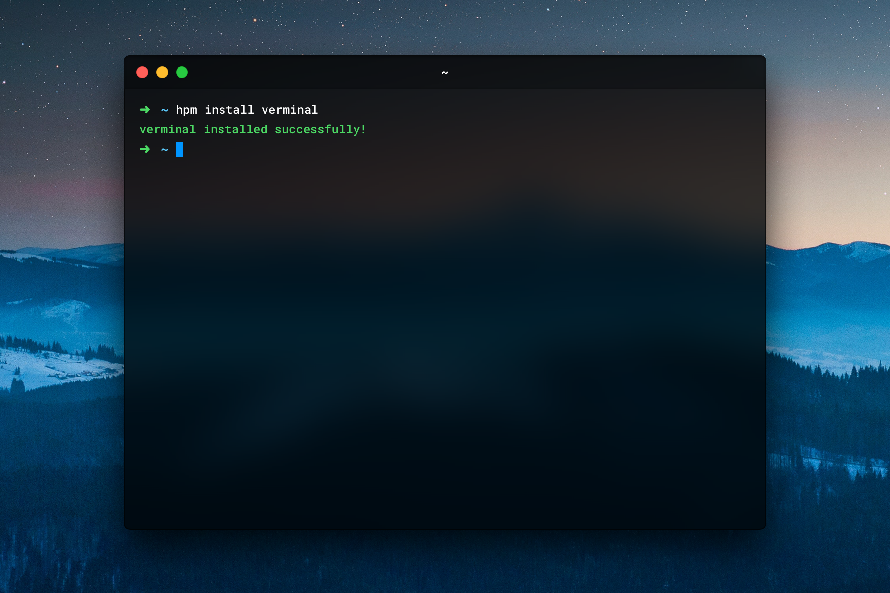

[](https://www.npmjs.com/package/verminal)
[](https://www.npmjs.com/package/verminal)

### Install using [HPM](https://github.com/zeit/hpm)
```
$ npm install -g hpm-cli
$ hpm install verminal
```

Restart Hyper and enjoy the Verminal.

### Install manually
1. Open `~/.hyper.js`.
2. Add `verminal` the the `plugins` array. 
3. Enjoy Verminal.

### Credits
This theme was originally developed by [@gielcobben](https://github.com/gielcobben).
